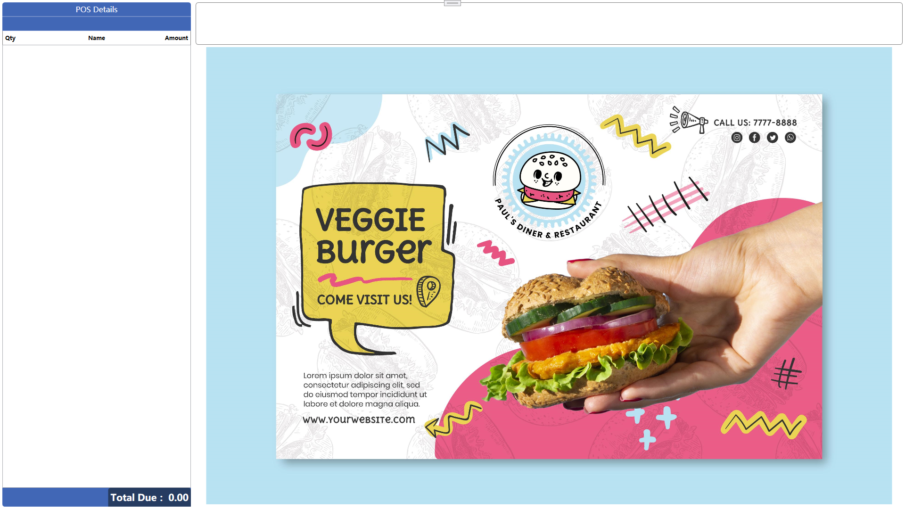

## Overview

Hello everyone, I will update the blogs related to **Micros Simphony** and **Res 3700** here in the future.

Because I mostly use Google Translate to write blogs. So some of the content may not be very clear, you can submit an **issue**.

## Contact

If you have any questions, you can contact me.

<a href="mailto:simphonydeveloper@outlook.com" target="_blank">Email</a>

[Telegram](./documents/telegram/README.md)

## My Products

[Simphony Screen](./products/simphony2screen/README.md): The ordering advertisement application for the second screen associated with the workstation.

*Click photo to view video*

## Resources

### Customize

[Simphony Custom Page with customized data analysis](https://youtu.be/nhxGVf9TkYs)

### Code

[3700 C# Models](https://github.com/simphonydeveloper/Micros3700Models)

[Some Example](https://github.com/simphonydeveloper/DevelopmentMessageBoard)

### Official website

My Sample Version [19.3]([Oracle MICROS Simphony 19.3 - Get Started](https://docs.oracle.com/en/industries/food-beverage/simphony/19.3/index.html)) 

[All Version]([Simphony - Simphony (oracle.com)](https://docs.oracle.com/en/industries/food-beverage/simphony/index.html))

### Help website

[TSAPI Gen1](https://simphonytsapi.docs.apiary.io/#)

[TSAPI Gen2](https://stsgen2.docs.apiary.io/)

[POS Discussion Website](https://www.tek-tips.com/threadminder.cfm?pid=693)

## Group

telegram:[go](https://t.me/+mrE74p7wRx0wMWZl)

## Coffee

If my content is helpful to you, can inject some energy into me. It will give me more motivation to update.

Thanks.

## Blogs

part1:[[Simphony]Get project reference entry from the database](documents/part1/README.md)

part2:[[Simphony]Execute multiple commands at once (Use OpsCommandType.Macro)](documents/part2/README.md)

part3:[[Simphony]CustomDialog  from WPF——Simple example)](documents/part3/README.md)

part4:[[Simphony]CustomDialog  from WPF——Build a complete dialog box)](documents/part4/README.md)

part5:[[Simphony]CustomDialog  from WPF——MVVM)](documents/part5/README.md)

part6:[[Simphony]Extensibility local database and Dapper ORM)](documents/part6/README.md)

part7:[[Simphony]How to use PrintReceipt](documents/part7/README.md)

part8:[[Simphony]DataStore DbKey writes data](documents/part8/README.md)

part9:[[Simphony]DataStore.ReadExtensionDataValue](documents/part9/README.md)

part10:[[Simphony]The relationship between CheckGuid and CheckSeq](documents/part10/README.md)

part11:[[Simphony]Simphony input box cancel event listening](documents/part11/README.md)

part12:[[Simphony]Customize button styles](documents/part12/README.md)

part13:[[Simphony]Print barcode(Code by Matt)](src/extensibility/SimphonyBlogs/SimphonyExample/Parts/Part13.cs)

part14:[[Simphony]HTML5 Sales chart](documents/part14/README.md)

part15:[[Simphony]How do  get a discount on a menuitem?](documents/part15/README.md)

part16:[[Simphony]Distinguish menuitem hold](documents/part16/README.md)

part17:[[Simphony]SqlCMD backup  simphony local database](documents/part17/README.md)

part18:[[Simphony]All Dialog Control Preview](documents/part18/README.md)

part19:[[Simphony]How to Add a CheckExtensibilityDetail?](documents/part19/README.md)

part20:[[Simphony]Order Information Service Assign,Close,CloseAllChecks](documents/part20/README.md)

part21:[[Simphony]Two different extensibility operations with the same value.](documents/part21/README.md)

part22:[[Simphony]Void multiple items simple example](documents/part22/README.md)

part23:[[Simphony]GetMenuItemDiscountedTotal](documents/part23/README.md)

part24:[[Simphony]Page Design-Custom Content Loader](documents/part24/README.md)

part25:[[Simphony]View the logs of the Extension Application](documents/part25/README.md)

