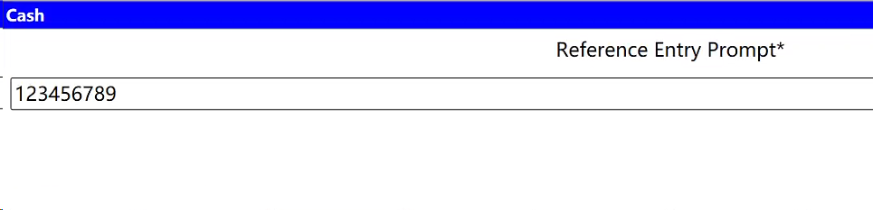
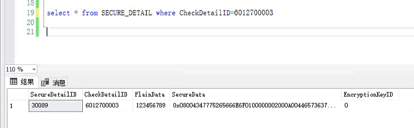
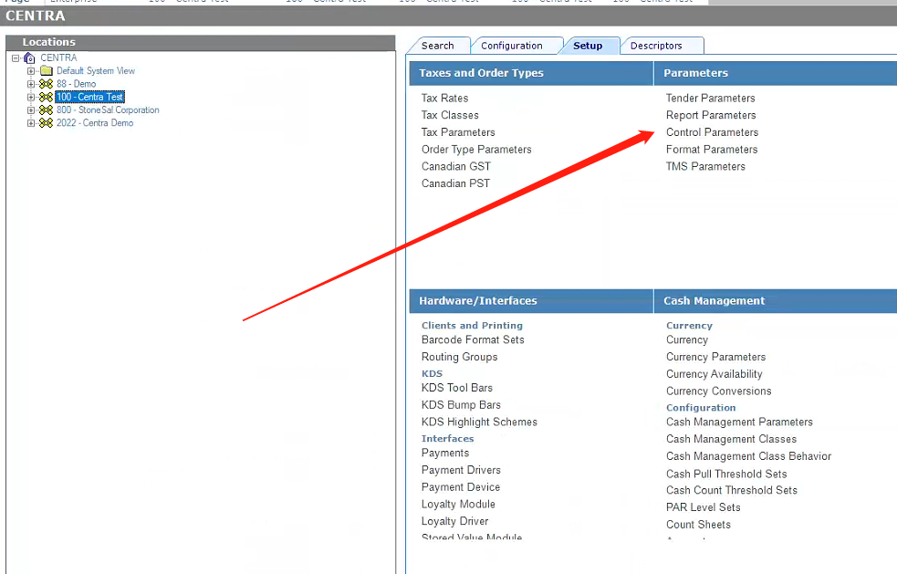
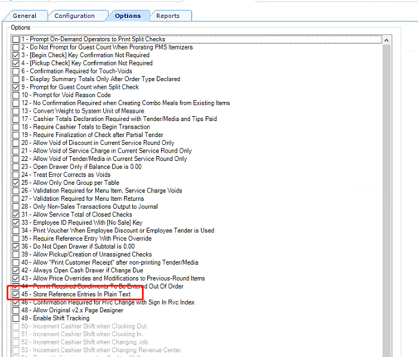

## Get project reference entry from the database

Sometimes we will include some information in the citation entry, such as member ID and third-party payment ID. Then, in other applications, I want to read the reference information for business processing.

### Example

I am entering a test information for Cash payment.



After completing the transaction, go to the database to query the reference information.

```sql
-- get plainData
select * from SECURE_DETAIL where CheckDetailID=6012700003

```





Under normal circumstances, it is actually encrypted and needs to be set up in **EMC** to see the text information.





Options  enable #45




Thank you, **Darshanp**. This is the inspiration he gave me.