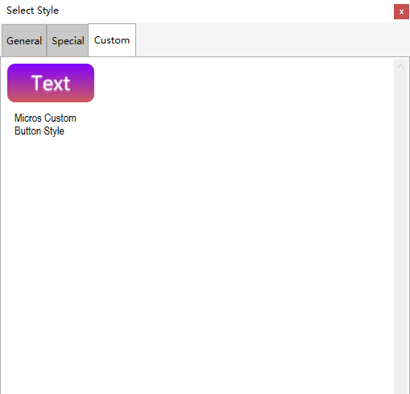

## Customize button styles

### Effect


There are a total of 25 EMC button styles, and we can customize them when other styles are needed.

To achieve it, you first need to configure style **Resource Dictionary** in **Content**.


```xml
<ResourceDictionary
    xmlns="http://schemas.microsoft.com/winfx/2006/xaml/presentation"
    xmlns:x="http://schemas.microsoft.com/winfx/2006/xaml"
    xmlns:mroot="clr-namespace:Micros.OpsUI;assembly=OpsUI"
    xmlns:mcontrol="clr-namespace:Micros.OpsUI.Controls;assembly=OpsUI"
    xmlns:mconverters="clr-namespace:Micros.OpsUI.Converters;assembly=OpsUI"
    xmlns:vsm="clr-namespace:System.Windows;assembly=wpftoolkit"
    xmlns:system="clr-namespace:System;assembly=mscorlib"
    xmlns:mwt="clr-namespace:Microsoft.Windows.Themes;assembly=PresentationFramework.Aero"
    >
     <Style x:Key="MicrosCustomButtonStyle" TargetType="mcontrol:Button">
        <Setter Property="Margin" Value="2" />
        <Setter Property="Foreground" Value="White"/>
        <Setter Property="ClickMode" Value="Release"/>
        <Setter Property="FontSize" Value="24" />
        <Setter Property="Template">
            <Setter.Value>
                <ControlTemplate TargetType="mcontrol:Button">
                <Border x:Name="border" BorderThickness="1"  CornerRadius="10" Padding="8,8,8,8">
                        <Border.Background>
                            <LinearGradientBrush StartPoint="1,0" EndPoint="1,1">
                                <GradientStop Color="#8000FF" Offset="0.0" />
                                <GradientStop Color="#CD5C5C" Offset="1.0" />
                            </LinearGradientBrush>
                        </Border.Background>

                        <ContentPresenter x:Name="content" HorizontalAlignment="Center" VerticalAlignment="Center">
                            <ContentPresenter.BitmapEffect>
                                <DropShadowBitmapEffect Color="White" Direction="-90" ShadowDepth="2" Softness="0.1" Opacity="0.3"></DropShadowBitmapEffect>
                            </ContentPresenter.BitmapEffect>
                        </ContentPresenter>
                    </Border>
                </ControlTemplate>
            </Setter.Value>
        </Setter>
    </Style>
</ResourceDictionary> 
```


Then you can choose a custom button style in the page design.

