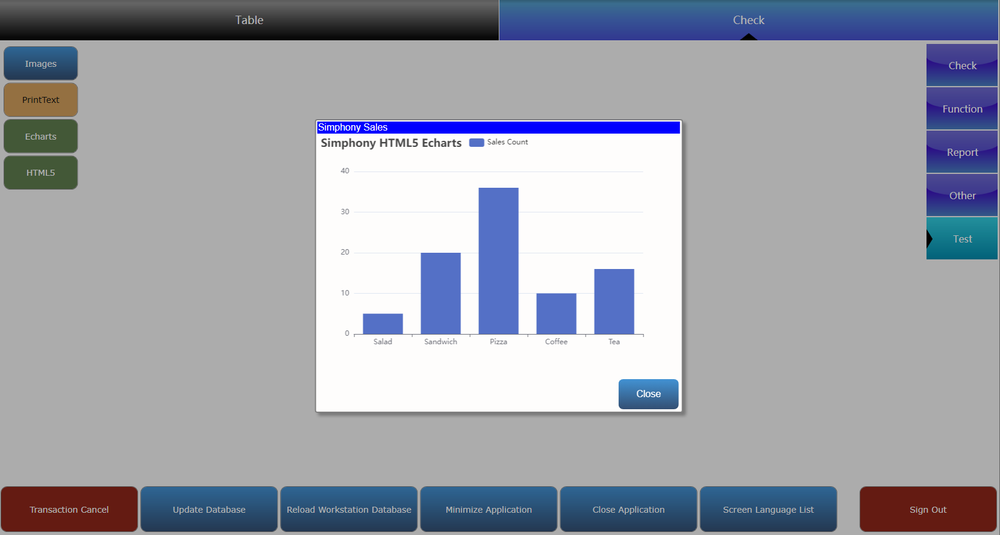

## Simphony HTML5 Extensibility

### Resources

Official PDF:https://docs.oracle.com/en/industries/food-beverage/simphony/19.5/sedrg/F79448_02.pdf

Example:https://docs.oracle.com/cd/E65545_01/html_extend/CustomHTMLDialogSample.zip


### Effect

A beautiful chart




### HTML5

When using HTML5 in Simphony, it should be developed first because Simphony has its own framework implementation method.

So I will first implement an HTML5 version.

```html
<!DOCTYPE html>

<html lang="en" xmlns="http://www.w3.org/1999/xhtml">
<head>
    <meta charset="utf-8" />
    <title></title>
    <!--echart-->
    <script src="https://cdn.jsdelivr.net/npm/echarts@5.4.3/dist/echarts.min.js"></script>
</head>
<body>
    <div id="main" style="width: 600px;height:400px;"></div>


    <script type="text/javascript">

        var myChart = echarts.init(document.getElementById('main'));

        var option = {
            title: {
                text: 'Simphony HTML5 Echarts'
            },
            tooltip: {},
            legend: {
                data: ['Sales Count']
            },
            xAxis: {
                data: ['Salad', 'Sandwich', 'Pizza', 'Coffee', 'Tea']
            },
            yAxis: {},
            series: [
                {
                    name: 'Sales Count',
                    type: 'bar',
                    data: [5, 20, 36, 10, 16]
                }
            ]
        };
        myChart.setOption(option);
    </script>
</body>
</html>
```


The framework of Simphony HTML5 has a main body. Under this subject, you can achieve anything you want.

```html
<!DOCTYPE html>

<html xmlns="http://www.w3.org/1999/xhtml">
<head>
    <link href="Simphony/POSTheme.css" rel="stylesheet" type="text/css" />
    <script src="Simphony/POSDialogAPI.js" charset="UTF-8"></script>
    
    <SCRIPT LANGUAGE='JavaScript'>
        function onload() {
            // older or incompatible browsers can sometimes cause Simphony/POSDialogAPI.js to fail to load.
            // If this happens the api object SimphonyPOSAPI may not exist causing very subtle failures.
            // Show an error if the SimphonyPOSAPI is undefined.
            if (!(("SimphonyPOSAPI" in window) && SimphonyPOSAPI)) {
                alert('SimphonyPOSAPI is undefined, browser is possibly not up to date');
                return;
            }
    </SCRIPT>
</head>

<body onload="onload()">
    <div class="SimphonyPOSDialogWindow SimphonyPOSCenterWindow" style="width:36.5%;">
    </div>
</body>
</html>

```

You should put your code in <code>  <div class="SimphonyPOSDialogWindow SimphonyPOSCenterWindow" style="width:36.5%;">
    </div></code>

```html
<!DOCTYPE html>

<html xmlns="http://www.w3.org/1999/xhtml">
<head>
    <link href="Simphony/POSTheme.css" rel="stylesheet" type="text/css" />
    <script src="Simphony/POSDialogAPI.js" charset="UTF-8"></script>
    <!--echart-->
    <script src="https://cdn.jsdelivr.net/npm/echarts@5.4.3/dist/echarts.min.js"></script>

    <SCRIPT LANGUAGE='JavaScript'>
        function onload() {
            // older or incompatible browsers can sometimes cause Simphony/POSDialogAPI.js to fail to load.
            // If this happens the api object SimphonyPOSAPI may not exist causing very subtle failures.
            // Show an error if the SimphonyPOSAPI is undefined.
            if (!(("SimphonyPOSAPI" in window) && SimphonyPOSAPI)) {
                alert('SimphonyPOSAPI is undefined, browser is possibly not up to date');
                return;
            }

            var myChart = echarts.init(document.getElementById('main'));

            var option = {
                title: {
                    text: 'Simphony HTML5 Echarts'
                },
                tooltip: {},
                legend: {
                    data: ['Sales Count']
                },
                xAxis: {
                    data: ['Salad', 'Sandwich', 'Pizza', 'Coffee', 'Tea']
                },
                yAxis: {},
                series: [
                    {
                        name: 'Sales Count',
                        type: 'bar',
                        data: [5, 20, 36, 10, 16]
                    }
                ]
            };

            myChart.setOption(option);
        }

    </SCRIPT>
</head>

<body onload="onload()">
    <div class="SimphonyPOSDialogWindow SimphonyPOSCenterWindow" style="width:36.5%;">
        <table>
            <tr>
                <td class="SimphonyPOSDialogTitleBar">Simphony Sales</td>
            </tr>
            <tr>
                <td>
                    <div id="main" style="width: 600px;height:400px;"></div>
                </td>
            </tr>
            <tr>
                <td align="right">
                    <button class="SimphonyPOSDialogControlButton" style="height:50px;width:100px;" onclick='SimphonyPOSAPI.closeDialog()'>Close</button>
                </td>
            </tr>
        </table>
    </div>
</body>
</html>
```

### Extension Code

```c
        [ExtensibilityMethod]
        public void Part14Test1()
        {
            Logger.LogAlways("Part14Test1-HTML5");

            var parms = new Micros.PosCore.Extensibility.UserInterface.ExtensibilityInPlaceHtmlDialogParameters();

            //i don't know why this method will get an error in 19.5，so i use other method to do.
            //string html = DataStore.ReadExtensionApplicationContentTextByNameKey(OpsContext.RvcID, ApplicationName, "EchartsHtml");
            Logger.LogAlways("get html");
            var extcontent = DataStore.ReadExtensionApplicationContentByKey(OpsContext.RvcID, "EchartsHtml");
            var html = Encoding.Unicode.GetString(extcontent.ContentData.DataBlob);
            Logger.LogAlways(html);
            parms.HTML = html;
            parms.ShowCloseButton = true;
            parms.DebugMode = false;

            // show dialog and get back result
            string result = OpsContext.ShowExtensibilityHtmlDialog(parms);
        }
```