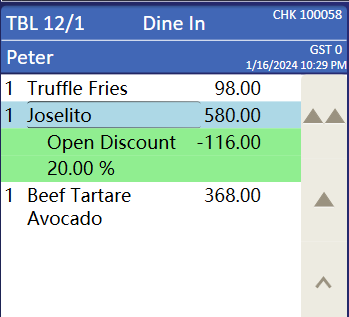

## How do  get a discount on a menuitem?

Sometimes we need to get the discount amount under a single dish. For example, this picture.



Now, I'll code how to get it.

First, to get the discount information, we need to know the **DetailLink** of the discount in this **Check**

### Code

```c#
        [ExtensibilityMethod]
        public void Part15Test1()
        {
            Logger.LogAlways("Part15Test1");

            //get currnet selected
            var currentItemDetailLink = this.OpsContext.CurrentChildItem;
            //discount parent menuitem
            var currentItemParentDetailLink = this.OpsContext.CurrentParentItem;

            Logger.LogAlways("get detailLink " + currentItemDetailLink);

            var discountItem = this.OpsContext.CheckDetail.FirstOrDefault(f => f.DetailLink == currentItemDetailLink);
            var menuitemItem = this.OpsContext.CheckDetail.FirstOrDefault(f => f.DetailLink == currentItemParentDetailLink);
            if (discountItem != null&& menuitemItem!=null)
            {
                this.OpsContext.ShowMessage($"Menuitem {menuitemItem.Name}-discountName {discountItem.Name}-discountAmt {discountItem.Total}");
            }
        }
```


### Effect

