## All Dialog Control Preview

### AskQuestion

yes or no.

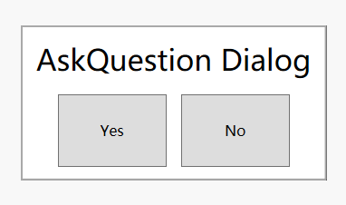

### MultiSelectionRequest

Great presence, suitable for multiple options.

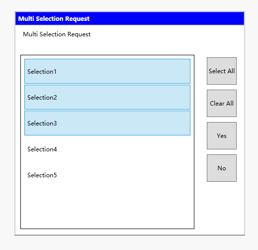

### RequestAlphaEntry

get a character string.

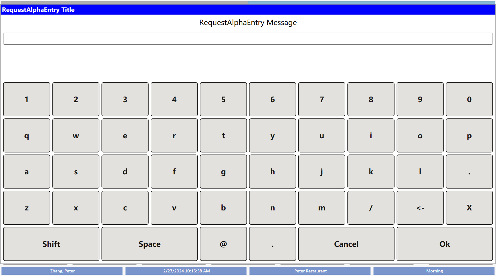

### RequestEntry

In fact, you can use it to implement all the methods related to Entry, which can be understood as universal, and its functionality is stronger, supporting Scanner.

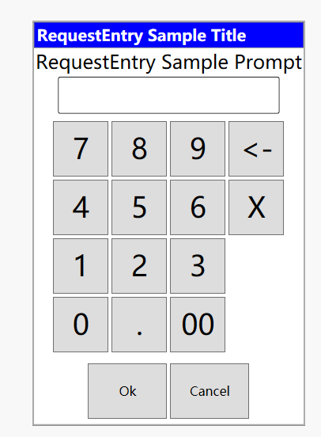

### RequestAmountEntry

Get an amount number, it may be null, so don't forget to check it.

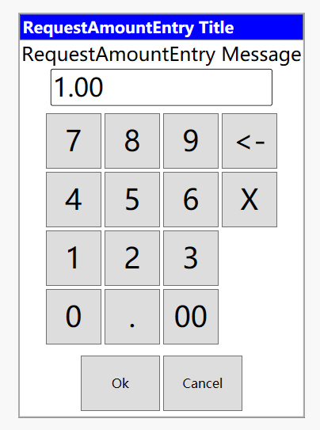

### RequestNumericEntry

Get a number without a decimal point, it may be null, so don't forget to check it.

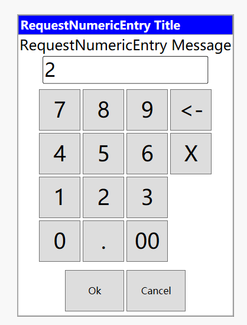

### RequestStringEntry

get a string number.

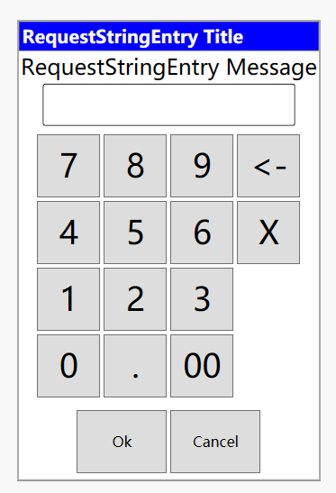

### SearchRequest

Search by name. For example, Section 1.

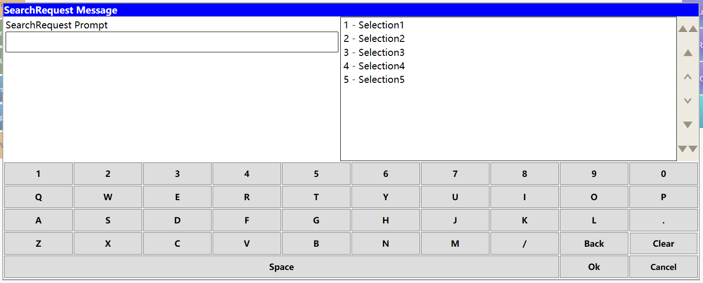

### SelectionRequest

Choose what you want. He has two methods, one is regular array content, and the other is a richer set of objects.

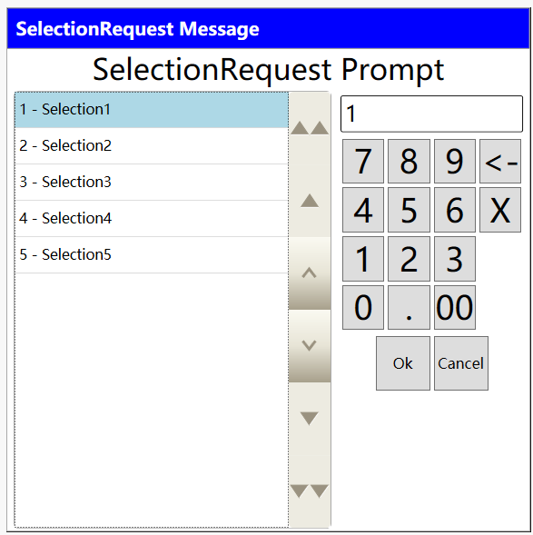

### ShowError

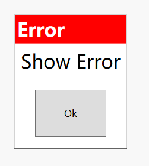

### ShowException

I think this is very helpful for developers as they can see detailed errors, which is of great significance.

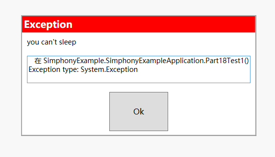

### ShowMessage

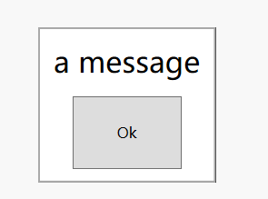

### ShowTextList

Can you display some multi line text content, such as logs?

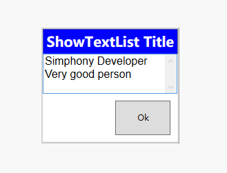

### SimRequestAmountEntry

Similar to RequestAmountEntry, but its value will never be NULL, which is their difference. And he won't display this default value, which is dependent on the user.

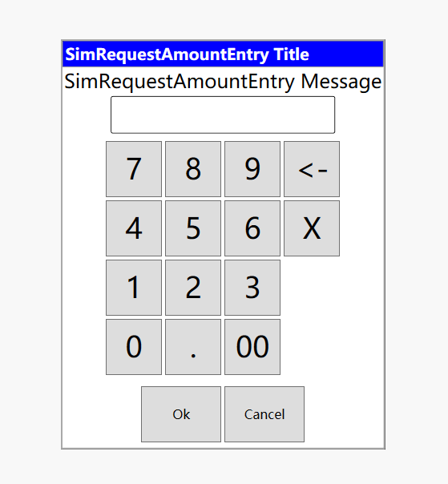

### SimRequestNumericEntry

Similar to RequestNumericEntry, but its value will never be null, which is their difference. And he won't display this default value, which is dependent on the user.

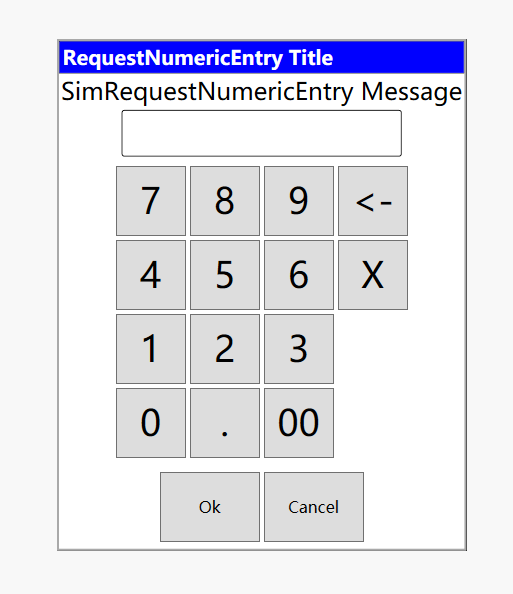

### SimSelectionRequest

It looks like SelectionRequest, right? Actually, it doesn't have as many features as SelectionRequest. It only supports IEnumerable.

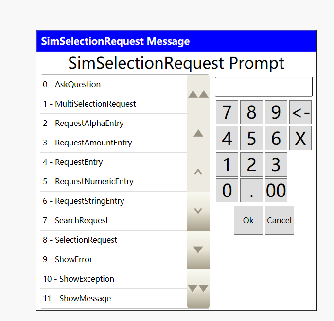

### StartProgressRequest

if you span value is 0.

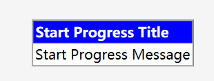

other span value.

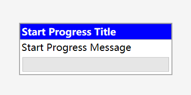

progressing.

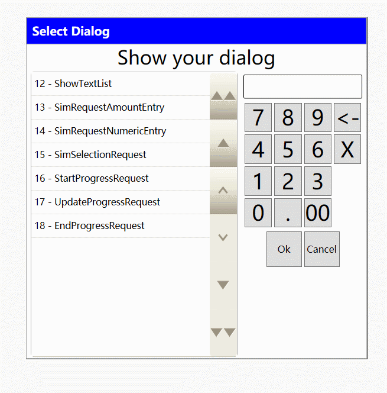

### UpdateProgressRequest

Associate with **StartProgressRequest**

### EndProgressRequest

Associate with **StartProgressRequest**