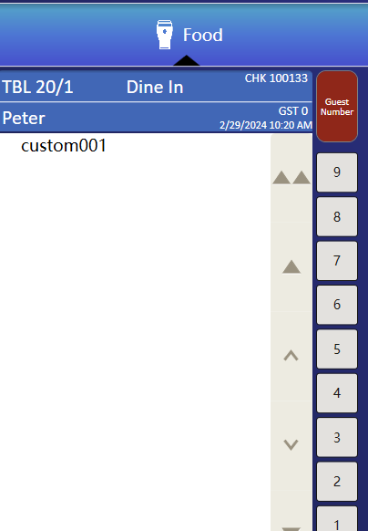

## How to Add a CheckExtensibilityDetail

Sometimes we may need to add additional display items to the check, such as card numbers, coupon numbers, and so on.

As shown below.



To achieve simplicity, you only need one line of code.

```c#
       [ExtensibilityMethod]
        public void Part19Test1()
        {
            Logger.LogAlways("Part19Test1");

            //custom input content
            var character = this.OpsContext.RequestAlphaEntry("custom detail line", "custom");

            //remember check null
            if (!string.IsNullOrEmpty(character))
            {
                //add info
                this.OpsContext.Check.AddExtensibilityData(new ExtensibilityDataInfo(character, "test", "test"));
            }
        }
```


