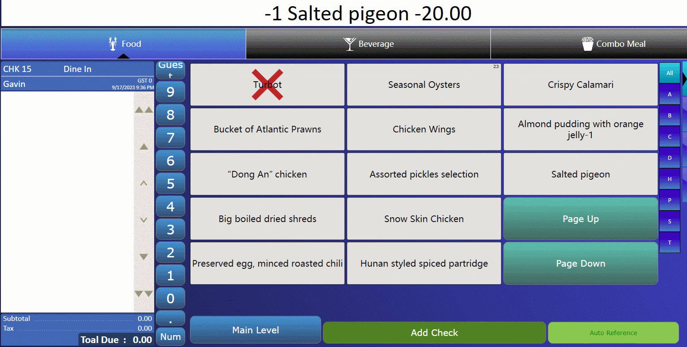

## Execute multiple commands at once (Use OpsCommandType.Macro)

Firstly, let's take a look at this example.



Usually, we need to receive an input reference entry, but this can be easily achieved through an Extension application.

```c#
        [ExtensibilityMethod]
        public void Part2Test1()
        {

            Logger.LogAlways("Par2Test1");

            OpsCommand cmdMacro1 = new OpsCommand(OpsCommandType.Macro);

            var commadData = new List<OpsCommand>();

            //my discount number
            commadData.Add(new OpsCommand(OpsCommandType.Discount) { Number = 1 });
            //my discount amount
            commadData.Add(new OpsCommand(OpsCommandType.AsciiData) { Text = "10.0" });
            //enter
            commadData.Add(new OpsCommand(OpsCommandType.EnterKey));
            //reference entry
            commadData.Add(new OpsCommand(OpsCommandType.AsciiData) { Text = "test reference entry" });
            //enter
            commadData.Add(new OpsCommand(OpsCommandType.EnterKey));
            cmdMacro1.Data = commadData;
            var result = OpsContext.ProcessCommand(cmdMacro1);
        }
```

Just configure the button operation.