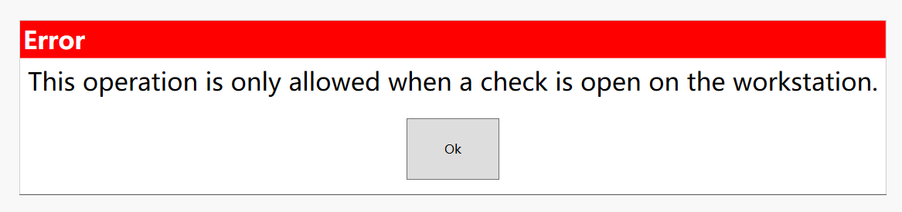
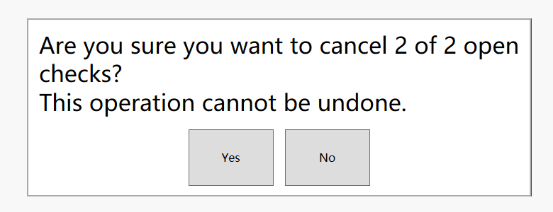

## Order Information Service Assign,Close,CloseAllChecks

*You can find this DLL on the Caps server.It itself is an extensibility.So you can use it directly.*

You just need to configure it like your extension.

https://docs.oracle.com/cd/F14820_01/doc.191/f15052/r_web_order_information_service_functions_arguments.htm#SIMCG-OrderInformationServiceFunctionsAnd-1D8F7A67

Thank for **Darshan's** ideas.

### Assign

This method is used to assign checks. For example, the manager assigns all checks for employee 1 to employee 2.

There are two of my orders now.I will convert these two checks into other employees through methods.

sample

Single or multiple can be controlled through **MultipleChecks**.

### Close

You must run this method in the open check. Otherwise, there is no permission.

like this.

### CloseAllChecks

This is very simple, click yes and you will be able to close all checks.Of course, you can also close orders according to different employees.

Just to set **EmployeeFilter**.

