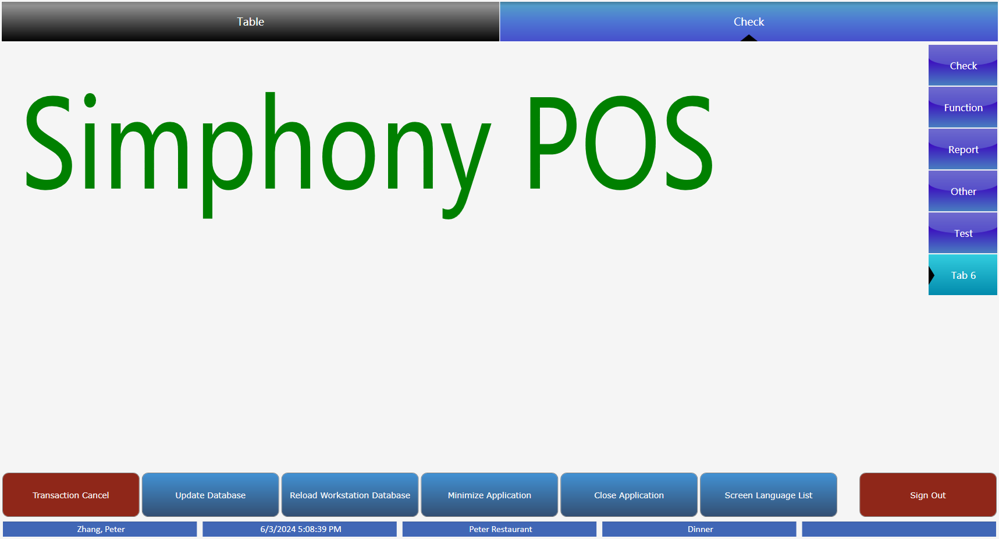
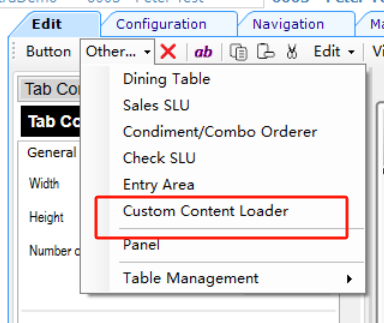
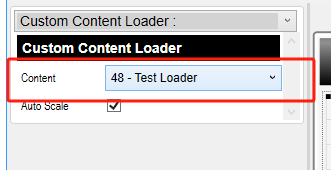

## Page Design-Custom Content Loader

### Preview



### How to achieve it?

Firstly, you need to create a record in the **Setup** -**Custom Content**- **Content**.

Content-Type：Loose Xaml

```xaml
<UserControl 
        xmlns="http://schemas.microsoft.com/winfx/2006/xaml/presentation"
        xmlns:x="http://schemas.microsoft.com/winfx/2006/xaml"
       >
    <Grid>
     <TextBlock Text="Simphony POS" Foreground="Green" FontSize="100" ></TextBlock>
    </Grid>
</UserControl>
```


Go to **Configuration**- **User Experience**-**Page Design**

This feature will currently cause my EMC to lag.



Select your Content record.




On the design page on the right, you can also drag to change the size.