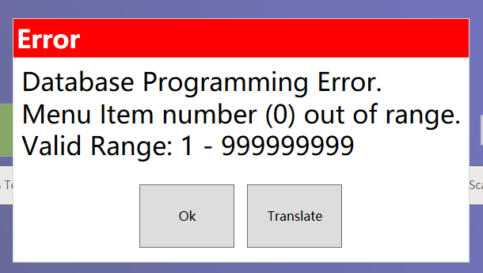

## OpsCommandType.AddMenuItem and MenuItem

The official documentation does not have code examples, so I will write some simple code examples.


### MenuItem

There are two ways to use a MenuItem.About <a href="#MenuItemCommandData">MenuItemCommandData</a>

```c#
[ExtensibilityMethod]
public void Part26Test1()
{
    Logger.LogAlways("Part26Test1");

    var selectedIndex = this.OpsContext.SelectionRequest("Select", "Select", new object[] { 1, 2 });
    if (!selectedIndex.HasValue)
        return;

    if (selectedIndex == 1)
    {
        this.OpsContext.ProcessCommand(new Micros.Ops.OpsCommand(Micros.Ops.OpsCommandType.MenuItem)
        {
            Number = 9224003,
        });
    }
    else
    {
        MenuItemCommandData menuItemCommandData = new MenuItemCommandData()
        {
            ObjectNumber = 9224003,
        };

        this.OpsContext.ProcessCommand(new Micros.Ops.OpsCommand(Micros.Ops.OpsCommandType.MenuItem)
        {
            Data = menuItemCommandData,
            Text = "1"
        });
    }
}
```


### AddMenuItem

The same as MenuItem.

```c#

        [ExtensibilityMethod]
        public void Part26Test2()
        {
            Logger.LogAlways("Part26Test2");

            var selectedIndex = this.OpsContext.SelectionRequest("Select", "Select", new object[] { 1, 2 });
            if (!selectedIndex.HasValue)
                return;

            if (selectedIndex == 1)
            {
                this.OpsContext.ProcessCommand(new Micros.Ops.OpsCommand(Micros.Ops.OpsCommandType.AddMenuItem)
                {
                    Number = 9224003
                });
            }
            else
            {
                MenuItemCommandData menuItemCommandData = new MenuItemCommandData()
                {
                    ObjectNumber = 9224003,
                };

                this.OpsContext.ProcessCommand(new Micros.Ops.OpsCommand(Micros.Ops.OpsCommandType.AddMenuItem)
                {
                    Data = menuItemCommandData,
                    Number = 9224003,
                    Text = "1"
                });
            }
```


### <span id="MenuItemCommandData">MenuItemCommandData</span>

```c#
namespace Micros.Ops
{
    public struct MenuItemCommandData
    {
        //an enum Button = 0,CondimentOrderer = 1,SLU = 2
        public MenuItemCommandDataSource Source;
        //emc menuitem definitionsequence number = Def Seq#
        public int DefinitionSequence;
        //about condiment
        public int CondimentGroup;
        public OpsContext OpsContext;
        //menuitem objnumber
        public int ObjectNumber;
        public int MainMenuLevel;
        public int SubMenuLevel;

        public MenuItemCommandData(MenuItemCommandDataSource source, OpsContext opsContext, int objectNumber, int mainMenuLevel, int subMenuLevel);

        public string Name { get; }

        public override bool Equals(object obj);
        public override int GetHashCode();
        public override string ToString();
    }
}
```


### Error

If you receive this error, please check OpsCommand.Text,the must have values.




