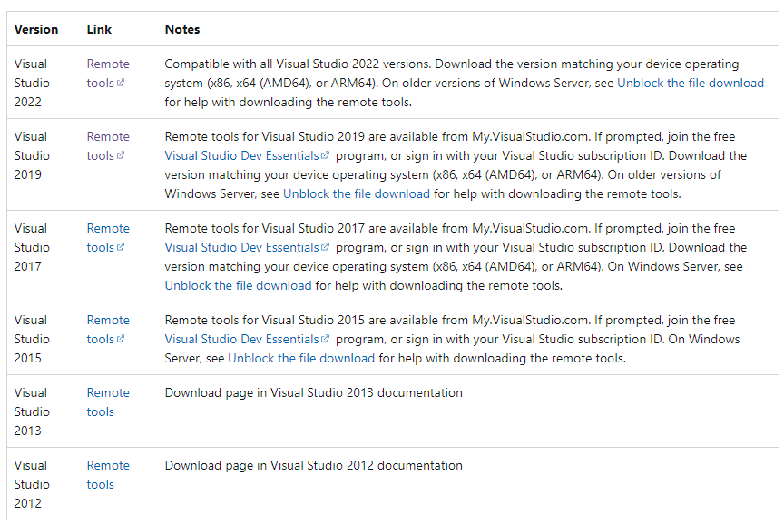
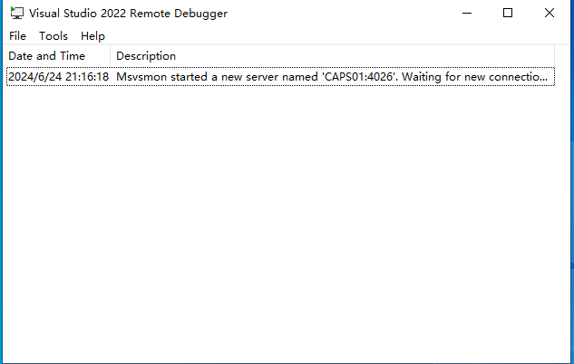
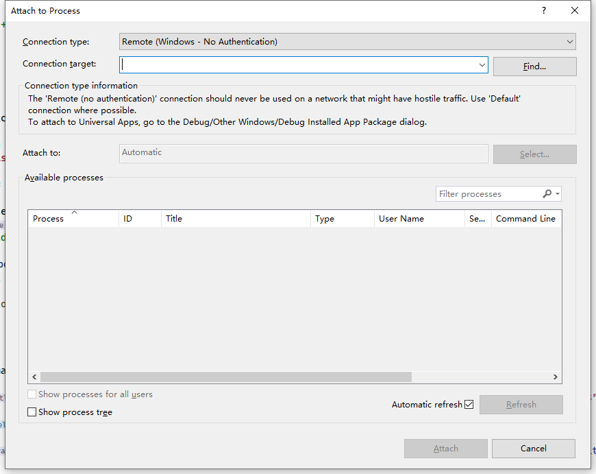
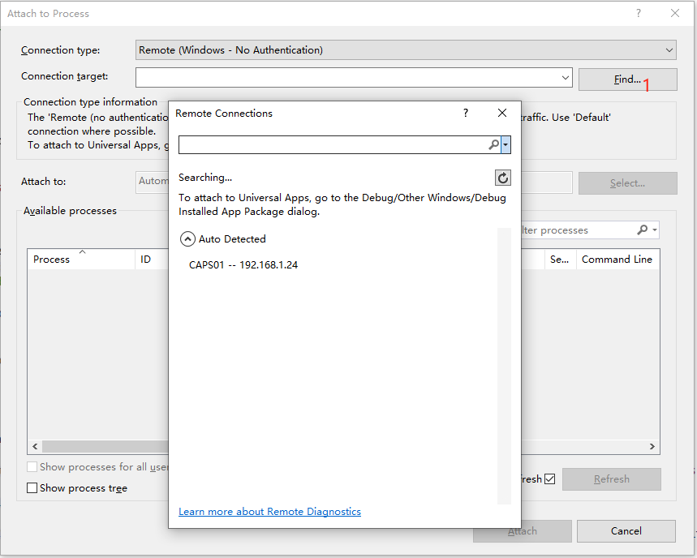
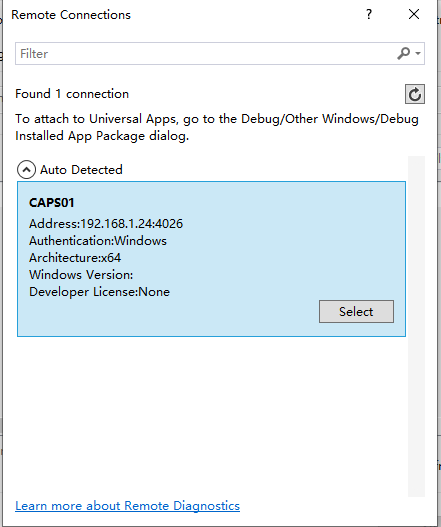
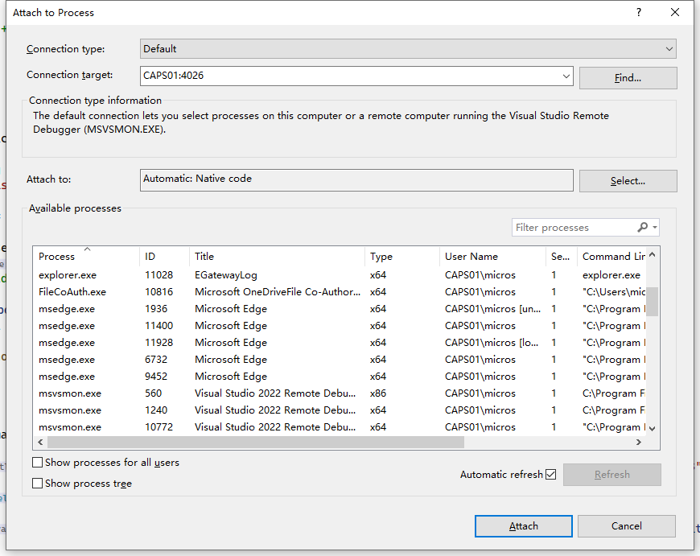
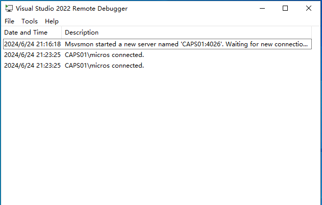

## Remote Debugging

Usually, when debugging ExtensionApplication, we use an additional process to debug it. Of course, if Simphony is installed on your development computer, it's quite simple.

What should we do if our development computer needs to connect to Simphony debugging on other machines?

### Download

First, download the Remote Debugger tool for VS2022.According to your VS version, download the content.

https://learn.microsoft.com/en-us/visualstudio/debugger/remote-debugging?view=vs-2022

### Install

After successful download, the Remote DebuggerTool needs to be installed on the Simphony machine that needs to be debugged.

### Use

Open the Remote Debugger.You can see the tool waiting for new connection.

Return to the development computer.

Open the VS2022.

Go to **Debug**-**Attach to Process**.Change **Connection type** to **Remote**

Click **Find** Button.Wait for a while, and it will automatically discover the computer that the Remote Debugger is turned on.

Click the Pc and Select.

Now,you can see all remote pc process.And you can also see that the Remote Debugger is connected.

Select the process for **ServiceHost**->Click **Attach** button.Then start your debugging.