## CustomDialog  from WPF——Simple example


### About WPF

Some people may not have used **WPF**

[WPF Basis]([Introduction to WPF | Microsoft Learn](https://learn.microsoft.com/en-us/dotnet/desktop/wpf/introduction-to-wpf?view=netframeworkdesktop-4.8&preserve-view=true))


### Create WPF

First, create a **WPF** project, be careful not to choose the wrong version and must use the**.NET Framework**

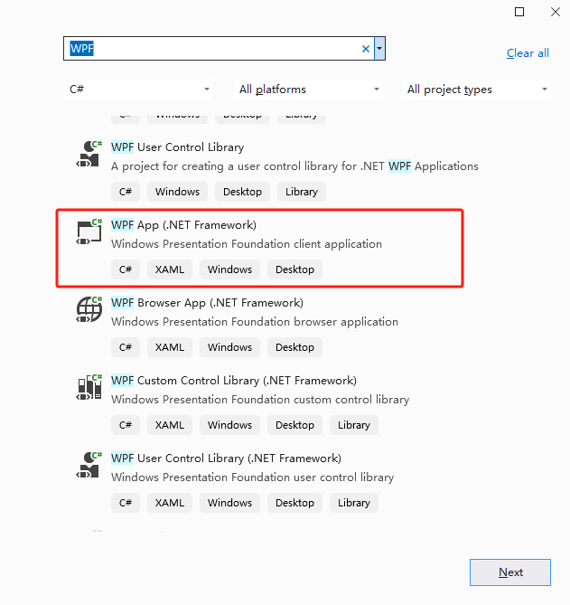


Select the corresponding version

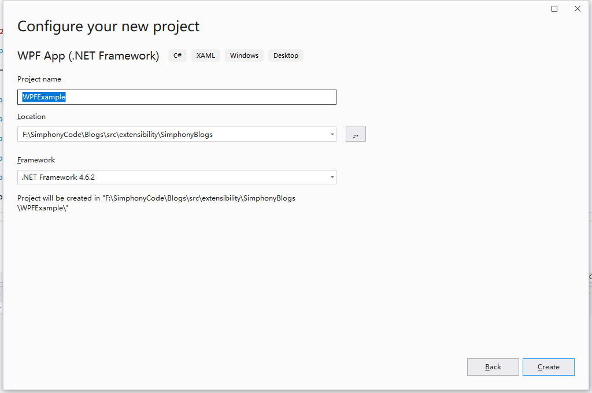


### Extensibility

[OpsContext.RequestCustomDialog Method (oracle.com)](https://docs.oracle.com/cd/E91245_01/api/html/6a3b7593-183d-b660-25f9-abab63f37314.htm)

Before starting, you can read the methods for displaying content in extensibility.

***message***

Type: [System.String](https://docs.microsoft.com/dotnet/api/system.string)
The message to be displayed.

***title***

Type: [System.String](https://docs.microsoft.com/dotnet/api/system.string)
The title of the request to be displayed.

***contentName***

Type: [System.String](https://docs.microsoft.com/dotnet/api/system.string)
The name of the content resource available in the content table that should be displayed.

***data***

Type: [System.Object](https://docs.microsoft.com/dotnet/api/system.object)
A user defined data object to be made availble to the content resource for binding.

**message** and **title** do not actually display content in actual development. Next, I will focus on the **contentName** and **data** content. This section will briefly run an example, and the following chapters will delve deeper into the components.

***contentName***：ContentName is the name of your WPF Control in **EMC Content**(setup->custom content->content)

***data***:Data binding,Often it will be a class.More advanced usage uses **MVVM** mode, which will be discussed later.

After understanding these, we can start coding.


### Create a UserControl

First, create a **UserControl**

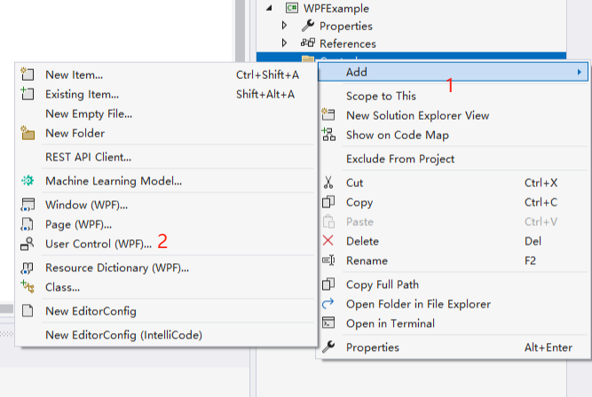


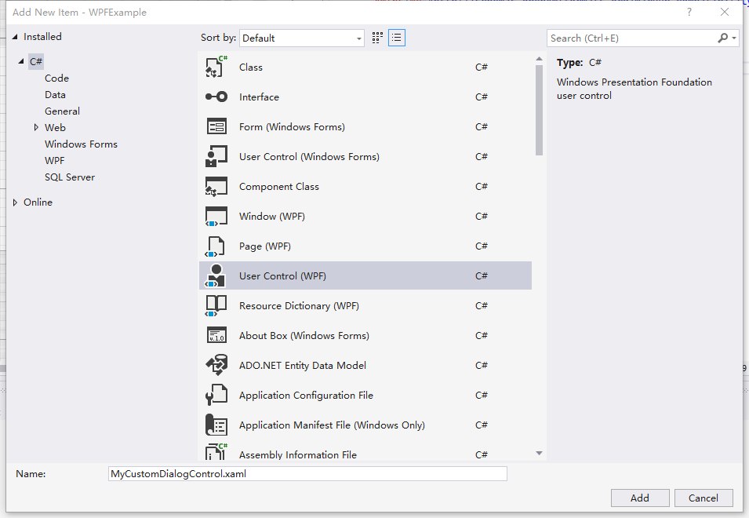


Add a **TextBlock** control.

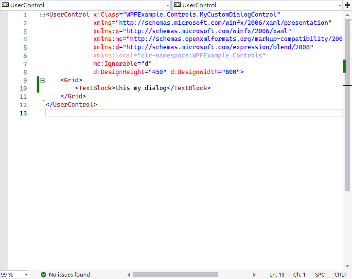

```xaml
<UserControl x:Class="WPFExample.Controls.MyCustomDialogControl"
             xmlns="http://schemas.microsoft.com/winfx/2006/xaml/presentation"
             xmlns:x="http://schemas.microsoft.com/winfx/2006/xaml"
             xmlns:mc="http://schemas.openxmlformats.org/markup-compatibility/2006" 
             xmlns:d="http://schemas.microsoft.com/expression/blend/2008" 
             xmlns:local="clr-namespace:WPFExample.Controls"
             mc:Ignorable="d" 
             d:DesignHeight="450" d:DesignWidth="800">
    <Grid>
        <TextBlock>this my dialog</TextBlock>
    </Grid>
</UserControl>
 
```


After clicking Save, you can see the content in the preview interface.

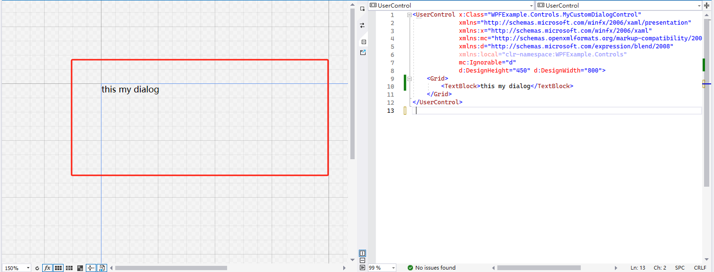

Next, we will reference this control in MainWindow.xaml.


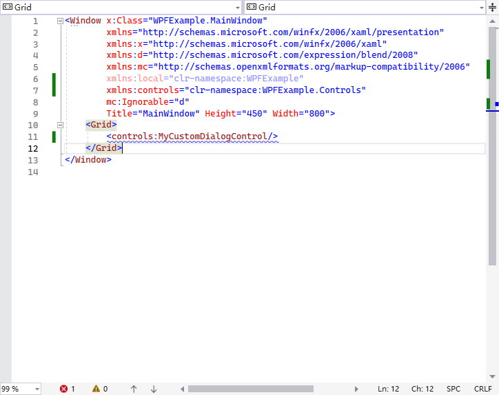

```xaml
<Window x:Class="WPFExample.MainWindow"
        xmlns="http://schemas.microsoft.com/winfx/2006/xaml/presentation"
        xmlns:x="http://schemas.microsoft.com/winfx/2006/xaml"
        xmlns:d="http://schemas.microsoft.com/expression/blend/2008"
        xmlns:mc="http://schemas.openxmlformats.org/markup-compatibility/2006"
        xmlns:local="clr-namespace:WPFExample"
        xmlns:controls="clr-namespace:WPFExample.Controls"
        mc:Ignorable="d"
        Title="MainWindow" Height="450" Width="800">
    <Grid>
        <controls:MyCustomDialogControl/>
    </Grid>
</Window>

```

Run the project.

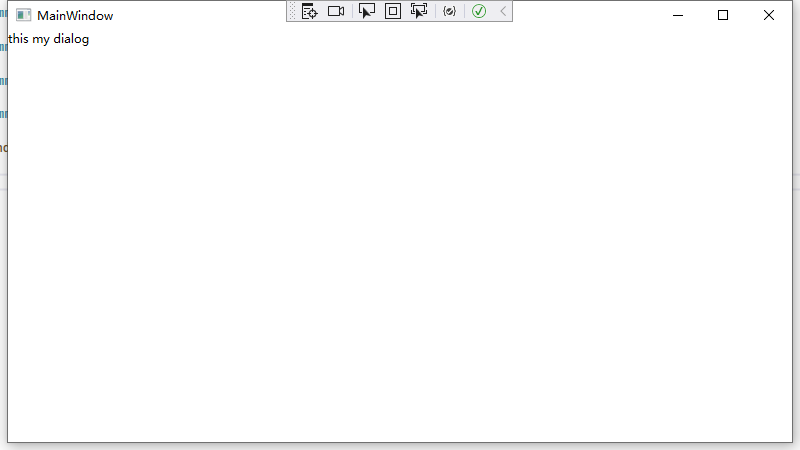

This simple control is now written, and the content of the control needs to be configured to EMC

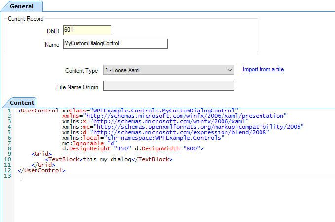


Next, use the OpsContext.RequestCustomDialogMethod.Create an extension method.

```c#
        [ExtensibilityMethod]
        public void Part3Test1()
        {
            Logger.LogAlways("Part3Test1");

            string contentName = "MyCustomDialogControl";
            this.OpsContext.RequestCustomDialog("test message", "test title", contentName, null);
        }
```

EMC configures a button to call this method.

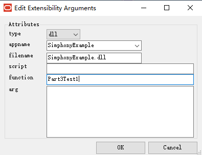

When you run the button, you will get an error, yes, the content in the **Content** is not entirely correct


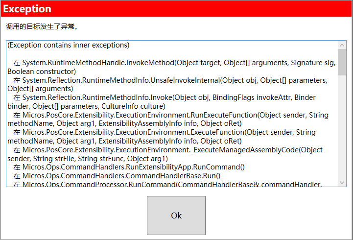

This is a step that blocks many people, so I did not directly provide the correct code earlier.

Under normal circumstances, referencing a UserControl's x: Class must be consistent with the main program, otherwise the application will fail. My custom UserControl did not keep up with SimphonyPOS until it encountered errors during loading.

Try the following code.

```xaml
<UserControl xmlns="http://schemas.microsoft.com/winfx/2006/xaml/presentation"
        xmlns:x="http://schemas.microsoft.com/winfx/2006/xaml"
        xmlns:mc="http://schemas.openxmlformats.org/markup-compatibility/2006" 
        xmlns:system="clr-namespace:System;assembly=mscorlib"
        xmlns:mconverters="clr-namespace:Micros.OpsUI.Converters;assembly=OpsUI"
        xmlns:mcontrol="clr-namespace:Micros.OpsUI.Controls;assembly=OpsUI"
        xmlns:mcfg="clr-namespace:Micros.OpsUI.Controls.Configuration;assembly=OpsUI"
        xmlns:mdesign="clr-namespace:Micros.OpsUI.Controls.Design;assembly=OpsUI"
        xmlns:d="http://schemas.microsoft.com/expression/blend/2008" 
             mc:Ignorable="d" 
             d:DesignHeight="450" d:DesignWidth="800">
    <Grid>
    <TextBlock Width="200" Height="200">this my dialog</TextBlock>
    </Grid>
</UserControl>
 
```

The dialog box appears!

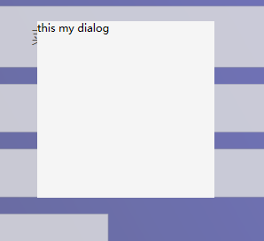


You can use ESC to close the dialog box.

So creating a CustominDialog is very complex.
1. Need to understand WPF knowledge.
2. A plugin needs to be created.
3. Need to understand EMC configuration.

In the next section, I will demonstrate how to use data to accept user input data.