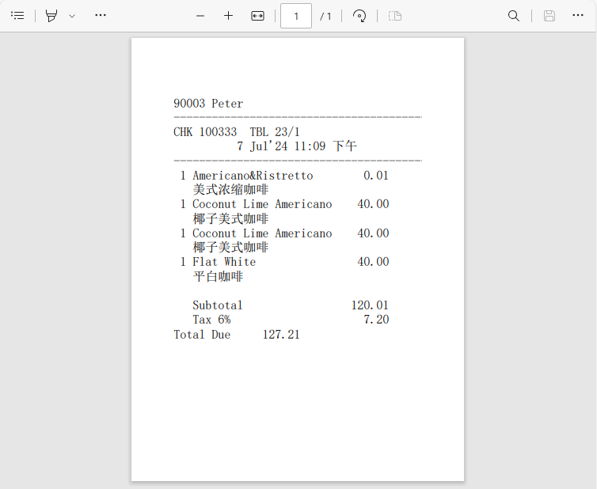

## Create a PDF

### Preview




### Code

The plugin I use to create PDFs is Spire.Pdf.

It has a free version, which is sufficient for use.

https://www.e-iceblue.com/Introduce/free-pdf-component.html

It has two DLLs referenced in the project.

**Spire.License.dll**

**Spire.Pdf.dll**

If you import a DLL from EMC, you will find that Spire is too large to import, so you need to manually place the DLL in the directory（C:\Micros\Simphony\WebServer\wwwroot\EGateway\Handlers\ExtensionApplications\SimphonyExample）.


```c#
[ExtensibilityMethod]
public void Part30Test1()
{
    Logger.LogAlways("Part30Test1");
    CreatePdf(AppContext.BaseDirectory + DateTime.Now.ToString("yyyyMMddHHmmss") + ".pdf");
    this.OpsContext.ShowMessage("pdf");
}


private void CreatePdf(string path)
{
    PdfDocument doc = new PdfDocument();
    //get pdf height by checkmenuitem count
    int existsMenuitems = this.OpsContext.CheckDetail.Where(w => w.Void == false).Count();

    float height = existsMenuitems * 30;
    Logger.LogAlways("get height" + height);
    PdfPageBase page = doc.Pages.Add(new SizeF(315, height + 300));
    //PdfPageSize

    PdfSolidBrush paraBrush = new PdfSolidBrush(new PdfRGBColor(System.Drawing.Color.Black));
    PdfTrueTypeFont paraFont = new PdfTrueTypeFont(new System.Drawing.Font("宋体", 12f, FontStyle.Regular), true);

    string checkstring = this.OpsContext.GetGuestCheckImage();
    PdfStringFormat format2 = new PdfStringFormat();
    format2.Alignment = PdfTextAlignment.Left;
    page.Canvas.DrawString(checkstring, paraFont, paraBrush, 0, 0, format2);

    //Save pdf file.
    doc.SaveToFile(path);
    doc.Close();
}
```

The next code will add the **logo**.