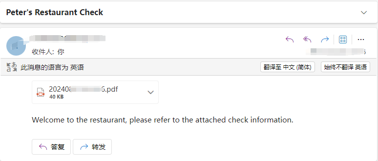

## Send to Email

This code will be modified in Part 30.


### Review




### Code

This is a method for sending emails, just provide the required parameters.

```c#
/// <summary>
/// Send an email
/// The sender needs to enable a third-party client service in their email, located at Settings -->Account -->POP3/SMTP Service -->Enable, to obtain an email authorization code
/// </summary>
/// <param name="senderEmail">sender email address</param>
/// <param name="authCode">authCode</param>
/// <param name="receiverEmail">receiver email address</param>
/// <param name="emailTitle">emailTitle</param>
/// <param name="emailContent">email Content(can html)</param>
/// <param name="smtpService">smtpService </param>
/// <param name="pdfPath">pdfPath</param>
public void SendEmail(string senderEmail, string authCode, string receiverEmail, string emailTitle, string emailContent, string smtpService, string pdfPath)
{
    MailMessage mailMsg = new MailMessage();
    mailMsg.From = new MailAddress(senderEmail);
    mailMsg.To.Add(new MailAddress(receiverEmail));
    mailMsg.SubjectEncoding = Encoding.UTF8;
    mailMsg.Subject = emailTitle;
    mailMsg.BodyEncoding = Encoding.UTF8;
    mailMsg.Body = emailContent;
    mailMsg.IsBodyHtml = true;
    mailMsg.Priority = MailPriority.Normal;


    SmtpClient client = new SmtpClient();
    client.Host = smtpService;
    client.Port = 587;
    client.EnableSsl = true;
    client.UseDefaultCredentials = false;
    //Verify sender identity (sender email, email generated authorization code)
    client.Credentials = new NetworkCredential(senderEmail, authCode);

    //add pdf attachment
    Attachment data = new Attachment(pdfPath, MediaTypeNames.Application.Octet);
    ContentDisposition disposition = data.ContentDisposition;
    disposition.CreationDate = File.GetCreationTime(pdfPath);
    disposition.ModificationDate = File.GetLastWriteTime(pdfPath);
    disposition.ReadDate = File.GetLastAccessTime(pdfPath);
    mailMsg.Attachments.Add(data);

    //send
    client.Send(mailMsg);
}
```

Use in conjunction with Part 30 code. You can achieve such an effect.

```c#
  [ExtensibilityMethod]
  public void Part30Test1()
  {
      Logger.LogAlways("Part30Test1");

      string pdfPath = AppContext.BaseDirectory + DateTime.Now.ToString("yyyyMMddHHmmss") + ".pdf";
      CreatePdf(pdfPath);
      //this.OpsContext.ShowMessage("pdf");

      string senderEmail = "";
      string authCode = "";
      string receiverEmail = "";
      string emailTitle = "Peter's Restaurant Check";
      //the eamil content can use html
      //string emailContent = "Welcome to the restaurant, please refer to the attached check information.";
      string emailContentHtml = "<a style=\"color: green\">Welcome to the restaurant, please refer to the attached check information.</a>";
      string smtpService = "";
      SendEmail(senderEmail, authCode, receiverEmail, emailTitle, emailContentHtml, smtpService, pdfPath);
  }


  private void CreatePdf(string path)
  {
      PdfDocument doc = new PdfDocument();
      //get pdf height by checkmenuitem count
      int existsMenuitems = this.OpsContext.CheckDetail.Where(w => w.Void == false).Count();

      float height = existsMenuitems * 30;
      Logger.LogAlways("get height" + height);
      PdfPageBase page = doc.Pages.Add(new SizeF(315, height + 300));
      //PdfPageSize

      PdfSolidBrush paraBrush = new PdfSolidBrush(new PdfRGBColor(System.Drawing.Color.Black));
      PdfTrueTypeFont paraFont = new PdfTrueTypeFont(new System.Drawing.Font("宋体", 12f, FontStyle.Regular), true);

      string checkstring = this.OpsContext.GetGuestCheckImage();
      PdfStringFormat format2 = new PdfStringFormat();
      format2.Alignment = PdfTextAlignment.Left;
      page.Canvas.DrawString(checkstring, paraFont, paraBrush, 0, 0, format2);

      //Save pdf file.
      doc.SaveToFile(path);
      doc.Close();
  }
```

