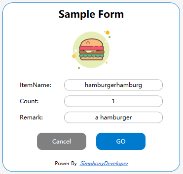

## A beautiful custom sample form

## Review




## Code

```xaml
<UserControl 
             xmlns="http://schemas.microsoft.com/winfx/2006/xaml/presentation"
             xmlns:x="http://schemas.microsoft.com/winfx/2006/xaml"
             xmlns:mc="http://schemas.openxmlformats.org/markup-compatibility/2006" 
             xmlns:d="http://schemas.microsoft.com/expression/blend/2008" 
             xmlns:local="clr-namespace:WpfApp1.Controls"
             xmlns:mcontrol="clr-namespace:Micros.OpsUI.Controls;assembly=OpsUI"
             xmlns:System="clr-namespace:System;assembly=mscorlib"
             BorderThickness="0"
             Background="Transparent"
             mc:Ignorable="d" 
             d:DesignHeight="450" d:DesignWidth="800">

    <UserControl.Resources>
        <SolidColorBrush x:Key="BackgroundColor" Color="White"/>
        <SolidColorBrush x:Key="TextColor" Color="Black"/>
        <SolidColorBrush x:Key="ButtonColor" Color="White"/>
        <SolidColorBrush x:Key="FocusBorderColor" Color="#007ACC"/>
        <SolidColorBrush x:Key="ControlMainColor" Color="#007ACC"/>
        <SolidColorBrush x:Key="CommonBrush" Color="#007ACC"/>
        <CornerRadius x:Key="CommonCorner">10</CornerRadius>
        <System:Double x:Key="CommonDisabledOpacity">0.5</System:Double>
        <System:Double x:Key="ButtonPressOpacity">0.8</System:Double>
        <System:Double x:Key="ButtonMouseOpacity">0.7</System:Double>

        <Style TargetType="{x:Type TextBox}" x:Key="TextBoxDefaultStyle">
            <Setter Property="Width" Value="200"/>
            <Setter Property="MinHeight" Value="23"/>
            <Setter Property="HorizontalContentAlignment" Value="Center"/>
            <Setter Property="VerticalContentAlignment" Value="Center"/>
            <Setter  Property="Template" >
                <Setter.Value>
                    <ControlTemplate TargetType="{x:Type TextBox}">
                        <Grid x:Name="PART_Root">
                            <Border x:Name="Bg" SnapsToDevicePixels="{TemplateBinding SnapsToDevicePixels}" CornerRadius="{StaticResource CommonCorner}"
                                BorderBrush="{TemplateBinding BorderBrush}" BorderThickness="{TemplateBinding BorderThickness}" Background="{TemplateBinding Background}" />
                            <Grid x:Name="PART_InnerGrid">
                                <Grid.ColumnDefinitions>
                                    <ColumnDefinition  Width="Auto" />
                                    <ColumnDefinition Width="*" />
                                    <ColumnDefinition  Width="Auto" />
                                </Grid.ColumnDefinitions>
                                
                                <ScrollViewer x:Name="PART_ContentHost" BorderThickness="0" Grid.Column="1" IsTabStop="False" Margin="2"
                                          VerticalAlignment="Stretch" Background="{x:Null}" />
                            </Grid>
                        </Grid>
                        <ControlTemplate.Triggers>
                            <Trigger Property="IsEnabled" Value="False">
                                <Setter TargetName="PART_Root" Property="Opacity" Value="{StaticResource CommonDisabledOpacity}" />
                            </Trigger>
                            <Trigger Property="IsFocused" Value="True">
                                <Setter TargetName="Bg" Property="BorderBrush" Value="{StaticResource FocusBorderColor}" />
                            </Trigger>
                            <Trigger Property="IsReadOnly" Value="True">
                                <Setter TargetName="Bg" Property="Opacity" Value="{StaticResource CommonDisabledOpacity}" />
                                <Setter TargetName="PART_ContentHost" Property="Opacity" Value="{StaticResource CommonDisabledOpacity}" />
                            </Trigger>
                        </ControlTemplate.Triggers>
                    </ControlTemplate>
                </Setter.Value>
            </Setter>
        </Style>

        <Style x:Key="ButtonDefaultStyle" TargetType="{x:Type Button}">
            <Setter Property="Width" Value="70"/>
            <Setter Property="Height" Value="25"/>
            <Setter Property="Foreground" Value="{DynamicResource ButtonColor}"/>
            <Setter Property="BorderThickness" Value="0"/>
            <Setter Property="Background" Value="{DynamicResource ControlMainColor}"/>
            <Setter Property="Template">
                <Setter.Value>
                    <ControlTemplate TargetType="{x:Type Button}">
                        <Border x:Name="Bg" CornerRadius="{StaticResource CommonCorner}" Background="{TemplateBinding Background}" BorderBrush="{TemplateBinding BorderBrush}" BorderThickness="{TemplateBinding BorderThickness}" SnapsToDevicePixels="True">
                            <TextBlock Text="{TemplateBinding Content}" Foreground="{TemplateBinding Foreground}" VerticalAlignment="Center" HorizontalAlignment="Center"/>
                        </Border>
                        <ControlTemplate.Triggers>
                            <Trigger Property="IsMouseOver" Value="True">
                                <Setter TargetName="Bg" Property="Opacity" Value="{StaticResource ButtonMouseOpacity}"/>
                            </Trigger>
                            <Trigger Property="IsPressed" Value="True">
                                <Setter TargetName="Bg" Property="Opacity" Value="{StaticResource ButtonPressOpacity}"/>
                            </Trigger>
                            <Trigger Property="IsEnabled" Value="False">
                                <Setter TargetName="Bg" Property="Opacity" Value="{StaticResource CommonDisabledOpacity}" />
                            </Trigger>
                        </ControlTemplate.Triggers>
                    </ControlTemplate>
                </Setter.Value>
            </Setter>
        </Style>
    </UserControl.Resources>
    <Border Margin="5" CornerRadius="20" BorderThickness="1" BorderBrush="{StaticResource CommonBrush}"  Background="{StaticResource BackgroundColor}" Width="360" Height="Auto" >
        <Grid>
            <Grid.RowDefinitions>
                <RowDefinition Height="Auto"/>
                <RowDefinition Height="Auto"/>
                <RowDefinition Height="*"/>
            </Grid.RowDefinitions>

            <TextBlock Text="Sample Form" FontSize="20" FontWeight="Bold" HorizontalAlignment="Center" Margin="0,10"/>
            <Image Grid.Row="1" Source="C:\image\hamburger.png" HorizontalAlignment="Center" VerticalAlignment="Center" Height="100" Width="100"></Image>
            
            <Grid Grid.Row="2">
                <Grid.RowDefinitions>
                    <RowDefinition Height="*"/>
                    <RowDefinition Height="*"/>
                    <RowDefinition Height="*"/>
                    <RowDefinition Height="*"/>
                    <RowDefinition Height="Auto"/>
                </Grid.RowDefinitions>
                
                <StackPanel Grid.Row="0" Orientation="Horizontal" HorizontalAlignment="Center" Margin="0,10,0,0" >
                    <TextBlock Text="ItemName:" VerticalAlignment="Center" TextAlignment="Left" Width="80"  />
                    <TextBox  Style="{StaticResource TextBoxDefaultStyle}" Height="23" Width="200" Margin="10,0,0,0" VerticalAlignment="Center"/>
                </StackPanel>
                <StackPanel Grid.Row="1" Orientation="Horizontal" HorizontalAlignment="Center" Margin="0,10,0,0">
                    <TextBlock Text="Count:" VerticalAlignment="Center" TextAlignment="Left" Width="80" />
                    <TextBox  Style="{StaticResource TextBoxDefaultStyle}" Height="23" Width="200" Margin="10,0,0,0" VerticalAlignment="Center"/>
                </StackPanel>
                <StackPanel Grid.Row="2" Orientation="Horizontal" HorizontalAlignment="Center" Margin="0,10,0,0">
                    <TextBlock Text="Remark:" VerticalAlignment="Center" TextAlignment="Left" Width="80" />
                    <TextBox  Style="{StaticResource TextBoxDefaultStyle}" Height="23" Width="200" Margin="10,0,0,0" VerticalAlignment="Center"/>
                </StackPanel>

                <StackPanel Margin="0,20,0,0" Grid.Row="3" Orientation="Horizontal" HorizontalAlignment="Center">
                    <mcontrol:Button OpsCommand="DialogCancel" OpsCommandText="1"  Style="{DynamicResource ButtonDefaultStyle}" Background="Gray" Content="Cancel" Height="35" Width="100" HorizontalAlignment="Center"></mcontrol:Button>
                    <Button  Style="{DynamicResource ButtonDefaultStyle}" Margin="20,0,0,0" Content="GO" Height="35" Width="100" HorizontalAlignment="Center"></Button>
                </StackPanel>

                <TextBlock Grid.Row="4" Margin="0,20,0,10" FontSize="10" HorizontalAlignment="Center"  >
                    <Run Text="Power By "/>
                    <Hyperlink  NavigateUri="https://github.com/simphonydeveloper/microsblogs" TextDecorations="Baseline" FontStyle="Italic">SimphonyDeveloper</Hyperlink>
                </TextBlock>
            </Grid>
        </Grid>
    </Border>
</UserControl>

```

