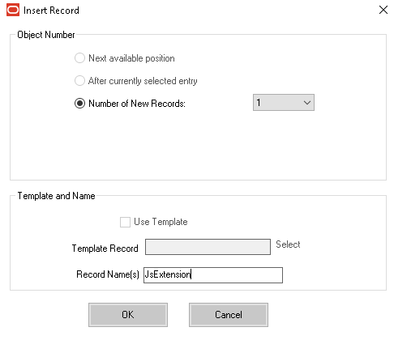
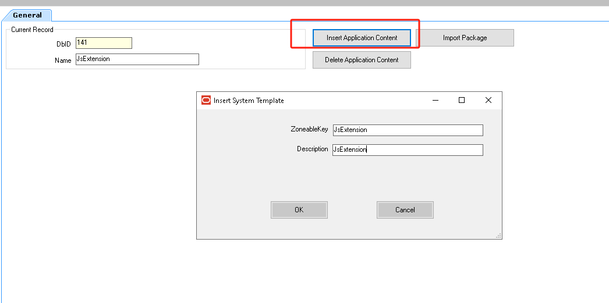
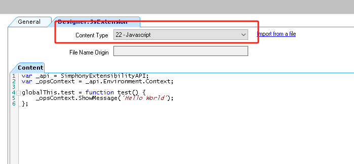
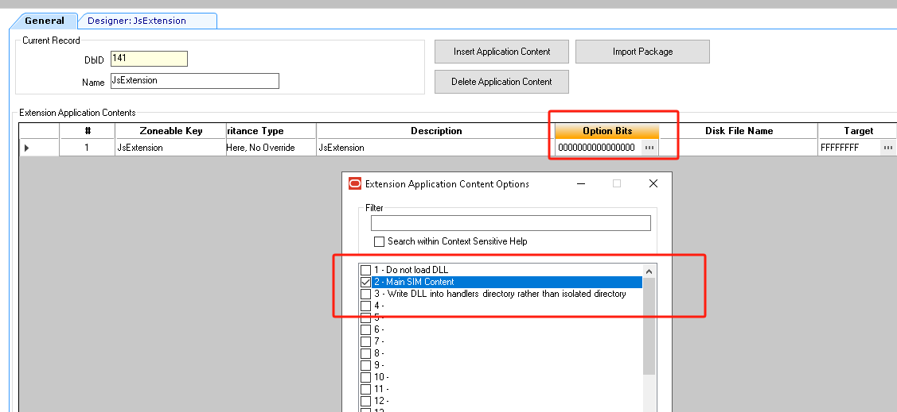
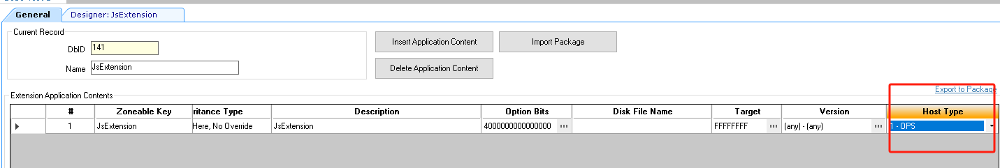
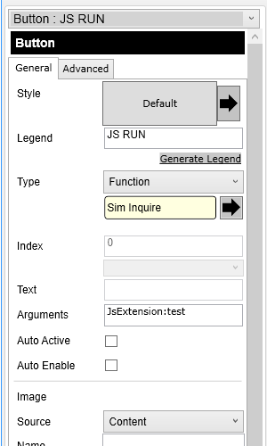

# Create a JavaScript Extensibility Example

JS Website:https://docs.oracle.com/en/industries/food-beverage/simphony/19.7/simjs/index.html


Sample:

```javascript
var _api = SimphonyExtensibilityAPI;
var _opsContext = _api.Environment.Context;

globalThis.test = function test() {
    _opsContext.ShowMessage('Hello World');
};
```


## Configuration

### Extension Application

add a new record and sete record name : **JsExtension**




then we can **Insert ApplicationContent**



Set the content-type:**JavaScript**  and put our JavaScript content.





don't forget config MainSim option for the content.




Set **Host-Type**



## Page Design

add a button .

Official website description

```javascript
The button should be configured as Function | Sim Inquire. The button "Argument" should be:

extAppName:functionName[:arg1[:arg2[:arg3]]]

for example:

myExtApp:myFunction
myExtApp:myFunction:1
myExtApp:myFunction:1:localhost:tcp
In each case the arguments are pass in as strings.

globalThis examples

//---------------------------------------------------
// No arguments for the exposed method
//---------------------------------------------------
globalThis.myFunction= function ()
{
    //Your code
}
//---------------------------------------------------
// One argument for the exposed method
//---------------------------------------------------
globalThis.myFunction= function (a1)
{
    //Your code
}
//---------------------------------------------------
// Two arguments for the exposed method
//---------------------------------------------------
globalThis.myFunction= function (a1, a2)
{
    //Your code
}
```

So this is how to configure the button.



Finally, you can go to POS testing.


More Information:

part34:[[Simphony]Simphony JavaScript Extensibility-Get Transaction Amount](../part34/README.md)

part35:[[Simphony]Simphony JavaScript Extensibility-Get Menuitems](../part35/README.md)

part36:[[Simphony]Simphony JavaScript Extensibility-Request Input Entry Method](../part36/README.md)

part37:[[Simphony]Simphony JavaScript Extensibility-Command](../part37/README.md)

part38:[[Simphony]Simphony JavaScript Extensibility-Eventing](../part38/README.md)

part39:[[Simphony]Simphony JavaScript Extensibility-Logger](../part39/README.md)

