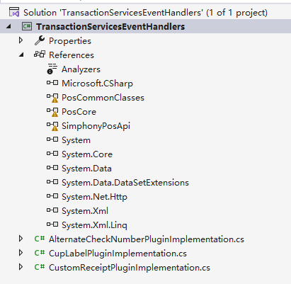

# How to  use  Transaction Service Gen1 Extensibility

Firstly, we found it based on the document.**Page 10-1**

https://docs.oracle.com/en/industries/food-beverage/simphony/19.8/simts/G16977_01.pdf

You can find the example code on page **10-3**.

TransactionServicesEventHandlers.zip

## Code

When you open the project, some DLLs may be missing. You can import the project.




Record the logs triggered by each event.

```c#
 public object CustomFormatting(DeviceType target, List<ExtensibilityOpsDisplayDetail> dtl, string customName, Dictionary<string, string> currentState)
 {
     ExtensibilityAppLogger.CurrentInstance.LogAlways("CustomFormatting");
 }
```


```c#
public bool GetAlternateCheckNumber(EventMonitorArgs args)
{
    ExtensibilityAppLogger.CurrentInstance.LogAlways("GetAlternateCheckNumber");
}
```


```c#
public bool CustomReceiptPrintFormat(EventMonitorArgs args, List<SortedDetailBase> list)
{
    ExtensibilityAppLogger.CurrentInstance.LogAlways("CustomReceiptPrintFormat");
}
```

Build a class library and then copy the generated DLL to the following path.

C:\Micros\Simphony\WebServer\wwwroot\EGateway

This path is not recorded in the document, it was found through some testing.


## Configuration

According to the instructions in the document, configure the **web.config.txt** file.The content here can be completely defined by oneself.

```xml
	<add key="CupLabelClassFile" value="TransactionServicesEventHandlers.dll,TransactionServicesEventHandlers.CupLabelPluginImplementation" />
	<add key="CustomReceiptClassFile" value="TransactionServicesEventHandlers.dll,TransactionServicesEventHandlers.CustomReceiptPluginImplementation" />
	<add key="AlternateCheckNumberFile" value="TransactionServicesEventHandlers.dll,TransactionServicesEventHandlers.AlternateCheckNumberPluginImplementation" />
```


## Test

Create a new check using Gen1 and you can see these contents in the log.

```05/31/25 22:22:09.364, 5, 0,ExtApps     ,       21,CustomFormatting,
5, 0,ExtApps     ,       21,CustomFormatting,
5, 0,ExtApps     ,       21,GetAlternateCheckNumber,
5, 0,ExtApps     ,       21,CustomReceiptPrintFormat,
```

