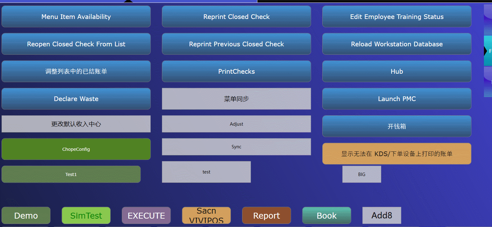

## Extensibility local database and Dapper ORM

example GIF:



### Extensibility

How to call local database in extended application?

You need two additional DLLs.

**EGatewayDB.dll**

**SimphonyUtilities.dll**

There are two local databases, so in order to facilitate better switching, I need to implement different DbConnections based on different databases

```c#
 internal class SimphonyDbConnectionFactory
    {
        private readonly DatabaseSettings _databaseSettings;

        public SimphonyDbConnectionFactory()
        {
            _databaseSettings = DatabaseSettings.GetDbSettingsSafe(DatabaseSettings.DatabaseAlias.LocalDb);
        }

        public SimphonyDbConnectionFactory(DatabaseSettings.DatabaseAlias database)
        {
            _databaseSettings = DatabaseSettings.GetDbSettings(database);
        }

        public IDbConnection CreateConnection() => new DatabaseConnection(_databaseSettings).Connection as DbConnection;
    }
```

### Dapper

After obtaining the DbConnection, I can use Dapper to perform various database operations.

Query, modify, add, delete. It is not recommended to perform other operations besides querying to avoid affecting other data.

How to obtain Dapper DLL?

You can first obtain the Dapper through NuGet Manager, and then place the Dapper in extensibility


All code:

```c#
       [ExtensibilityMethod]
        public void Part6Test1()
        {
            Logger.LogAlways("Part6Test1");

            List<OpsSelectionEntry> entries = new List<OpsSelectionEntry>();

            entries.Add(new OpsSelectionEntry((int)DatabaseSettings.DatabaseAlias.LocalDb, "DataStore"));
            entries.Add(new OpsSelectionEntry((int)DatabaseSettings.DatabaseAlias.CPServiceDb, "CheckPostingDB"));

            var selected = this.OpsContext.SelectionRequest("Select Database", "Please Select Execute Database", entries);
            if (!selected.HasValue)
                return;

            var selectedDB = entries[selected.Value];

            SimphonyDbConnectionFactory simphonyDbConnectionFactory = new SimphonyDbConnectionFactory((DatabaseSettings.DatabaseAlias)selectedDB.Number);

            using (var conn = simphonyDbConnectionFactory.CreateConnection())
            {
                var checks = conn.Query<dynamic>("select * from checks");

                string msg = $"{selectedDB.Name} checks count {checks.Count()}";
                this.OpsContext.ShowMessage(msg);
            };
        }
```


