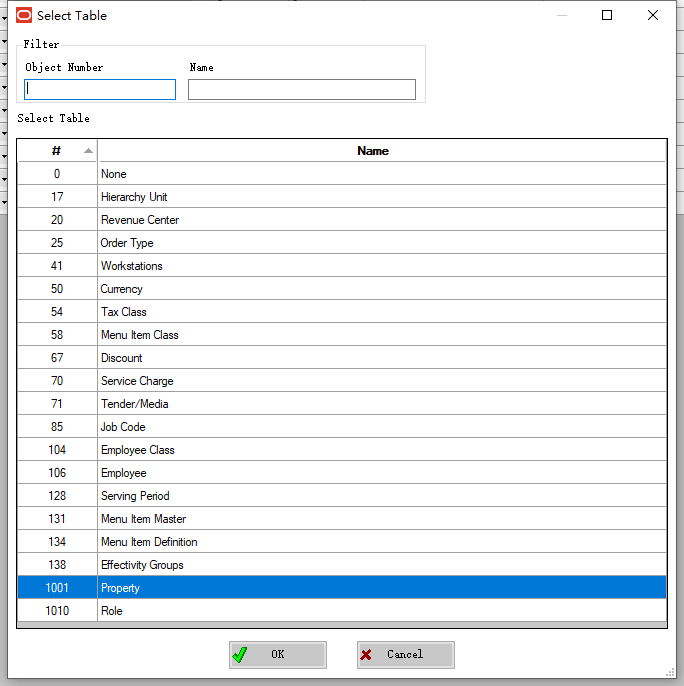
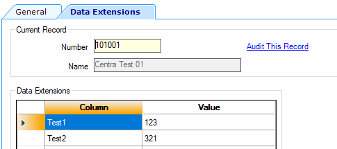
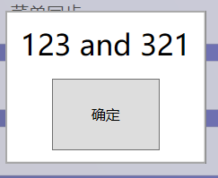

## DataStore.ReadExtensionDataValue

Firstly, Data needs to be added to EMC.

**Enterprise**->**Data Extensions**



field value.




read the dataExtension.

```c#
       [ExtensibilityMethod]
        public void Part9Test1()
        {
            Logger.LogAlways("Part9Test1");


            var test1 = this.DataStore.ReadExtensionDataValue("Property", "Test1", this.OpsContext.PropertyID);
            var test2 = this.DataStore.ReadExtensionDataValue("Property", "Test2", this.OpsContext.PropertyID);

            this.OpsContext.ShowMessage($"{test1} and {test2}");

        }
```


run method.



