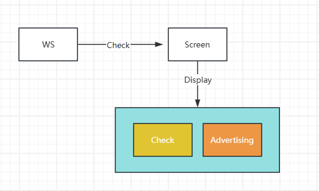

# SimphonyScreen

## Guide

A tool similar to Simphony OCBs.

[Texas Digital Order Confirmation Board (OCB) (oracle.com)](https://docs.oracle.com/en/industries/food-beverage/simphony/19.6/simcg/c_order_confirmation_board.htm)

But SimphonyScreen is different. SimphonyScreen is mainly suitable for displaying some advertisements to customers while placing orders.



## Plan

✅Completed   ⬜Developing

✅Open check synchronization check

✅Menuitem and condiments synchronization  check

✅Close Check synchronization  check

✅Save Check(Service Total) synchronization  check

✅Check Information(EmployeeName,CheckNumber,Total Due,Tax,Other,Service,Subtotal......)

✅Service Charge

✅Discount

✅Tax

✅Combo

✅Photo advertising(rotating)

✅Video advertising

⬜Text advertising (colorful)

⬜Version compatibility (2.9, 18, 19)


## Use

The installation files are in the same directory.

After successful installation, the page will display **SimphonyExtension**, which contains DLL content.It needs to be configured in EMC.


In the **settings**, you can choose **images** or **videos** to display advertisements.

Video:The video will be played in a loop.
Image:The image will be played according to the time interval (of course, one image will not)


Then you need to win+p and select Extend.

The Open button will open the advertising page, The Close button can close it.

[Feedback](https://github.com/simphonydeveloper/microsblogs/discussions/2)

Activate Code.

```text
AAEAABAAAADDYWCt29K+QvWjHMQTmrkw00GKS9ZquPk9779rjfv7UdS/440mNnnkOv9HoCHavuYya43Kb5lNIWZuD2t/LDhmlWdlB5jiVcM31H8dtv3QxU8vYoXr961hs7vLNwx6EWLVOd1jUCYLSx7MuCjqZuyxDxcsZ1whCVqD7GL/JtrA08lf4Xd5lHjybVkEDcJR0IoDBsisNCTA6MrkKPaNwj6iYjVVEOqa4Ly41W6yHoOOGTXZKwHwF7bWhAflL1C8apPxvxALcgvmsaGGwWeI7HndBW+GPsqvtujacI5mRLNtmBJfjqJPJAhtHqCenCK4c7OB73RcSQgoaFRKNJWXr/mAk2MaZ1GCyXoNj/tTzOuqf3AyS20KDggEltt7uZtQN/cYIiz8iFHYQetoUzARvKwJ2JNhGJ3GqLnXBS35k51qpzESyTIPhpOlMIS9+uljU18VXcfeekmceLq751zb1q084CHF5MwThKHFzByHP92sC4Z1dEFgY7JRaXJD5YP1PdagCowNjIc6ZVGCQlWiBW7+C2LUU5WGYKRh+GWGBIPCIQ==
```


## Ultimate Plan

Web management backend, online management of all Simphony Screen clients.Version control, advertising content control, etc